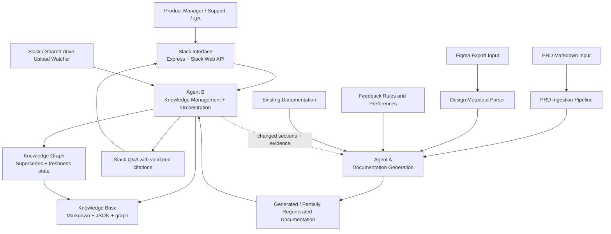
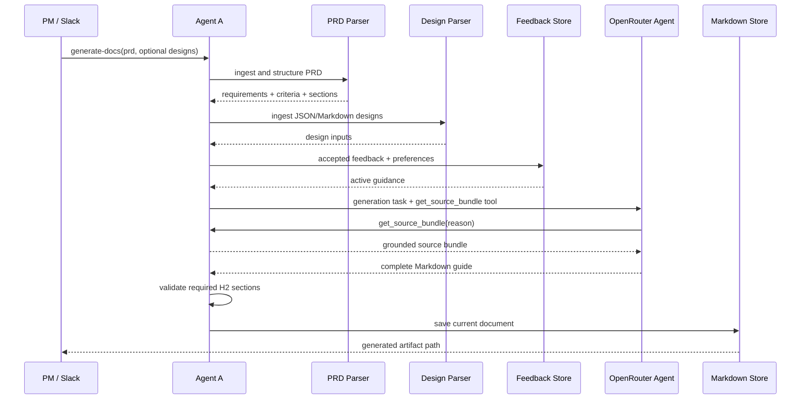
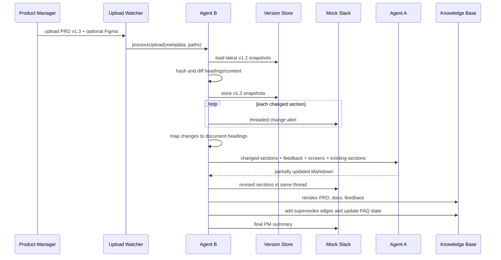
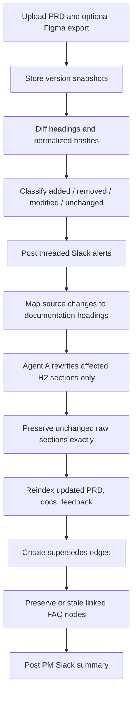

# AI Documentation Agent System — Technical Architecture

**Status:** Implemented reference architecture  
**Audience:** Engineering leadership, product management, customer support leadership, and technical interview evaluators  
**Primary implementation:** `doc-agent-system/`  
**Sample domain input:** `samplePRD/sample-prd-scheduled-compliance-reports.md`

## 1. Executive Summary

The AI Documentation Agent System keeps product documentation aligned with changing product requirements, design artifacts, and human feedback. It treats the Scheduled Compliance Reports PRD as sample source material; it does not implement the compliance-reporting product itself.

The system has seven principal capabilities:

- **Agent A — Documentation Generation Agent:** turns parsed PRDs, optional Figma exports, existing documentation, and accepted feedback into user-facing Markdown. For updates, it can regenerate individual H2 sections while preserving all unaffected sections exactly.
- **Agent B — Knowledge Management Agent:** orchestrates source versioning, change detection, documentation impact analysis, knowledge indexing, FAQ freshness, citations, and Slack Q&A.
- **Knowledge Base:** stores PRD, documentation, feedback, Q&A, version snapshots, and graph edges as local Markdown and JSON files in an Obsidian-style layout.
- **Slack Interface:** exposes signed Express endpoints, Slack Web API event handling, asynchronous slash-command responses, and a local adapter for credential-free tests and demos.
- **Figma Integration:** ingests JSON or Markdown design exports, hashes screens or frames, matches changed product areas to relevant screens, and supplies those screens to Agent A during regeneration.
- **PRD Ingestion Pipeline:** parses Markdown headings, requirements, priorities, acceptance criteria, assumptions, dependencies, open questions, appendices, and non-functional requirements into structured data.
- **Feedback Loop:** records PM, Customer Support, and QA feedback, applies accepted feedback during generation, and detects repeated style or content preferences.

The central problem is synchronization. Traditional documentation becomes stale because PRDs, acceptance criteria, and designs change independently after the initial guide is written. This system makes source changes observable and actionable: Agent B compares uploaded versions by heading and normalized hash, notifies Slack, calculates which documentation sections are affected, asks Agent A to rewrite only those sections, reindexes the result, creates version graph edges, and marks dependent FAQs stale for review.

OpenRouter's Agent SDK provides model-driven generation and grounded Q&A. Deterministic fallbacks keep local development and tests credential-free. Runtime responses expose their mode (`openrouter-agent`, `hybrid-fallback`, or `deterministic-fallback`) so an AI failure cannot silently masquerade as an AI result.

## 2. System Architecture



### Component responsibilities

| Component | Responsibility | Primary implementation |
|---|---|---|
| Agent A | Full and partial documentation generation; feedback application; source-aware rewriting | `agents/agentA.js` |
| Agent B | Version orchestration, impact analysis, indexing, FAQ state, and Q&A | `agents/agentB.js` |
| PRD parser | Markdown structure and requirement extraction | `lib/prdParser.js` |
| Change monitor | Content normalization, SHA-256 hashing, PRD/Figma diffing, and impact mapping | `lib/changeMonitor.js` |
| Version store | Versioned PRD/Figma JSON snapshots and latest pointers | `lib/versionStore.js` |
| Knowledge base | Markdown notes, document versions, graph edges, FAQ index, lexical retrieval | `lib/knowledgeBase.js` |
| OpenRouter runtime | Agent SDK calls and typed source/search tools | `utils/openRouterAgent.js` |
| Slack Web API adapter | Production slash commands, response URLs, file events, and app mentions | `adapters/mockSlack.js`, `slackServer.js` |
| Local Slack adapter | Credential-free commands, alerts, replies, and thread capture | `adapters/localSlack.js` |
| Mock upload watcher | Slack/shared-drive upload boundary | `adapters/mockUploadWatcher.js` |
| Jira Cloud adapter | Issue creation, Markdown attachment upload, feedback comments, and discovered workflow transitions | `adapters/jiraCloud.js` |

### Architectural principles

1. **Deterministic detection, generative rewriting.** Hashing and change classification are deterministic. The LLM is used to explain and rewrite, not to decide whether bytes changed.
2. **Grounding before generation.** Agent A must invoke `get_source_bundle`; Agent B must invoke `search_knowledge_base` before an AI result is accepted.
3. **Minimal mutation.** Partial regeneration replaces only explicitly affected H2 sections.
4. **Auditable provenance.** Version snapshots, source hashes, citations, supersedes edges, feedback records, and FAQ state are persisted locally.
5. **Adapter boundaries.** Slack, Jira, Figma exports, and shared-drive uploads are isolated from core domain logic.

## 3. Agent A — Documentation Generation Agent

### Purpose

Agent A automatically produces user-facing documentation from product requirements and design artifacts. It supports an initial full-document generation path and a surgical partial-regeneration path.

### Inputs

- Parsed PRD Markdown and its structured requirements
- Optional Figma JSON or Markdown exports
- Accepted feedback from PM, Customer Support, or QA
- Repeated feedback preferences derived from history
- Existing documentation during partial regeneration
- Changed PRD/Figma sections and matched screens during update processing

### Outputs

The currently implemented output is a Markdown user guide containing overview, audience, setup workflows, delivery, download, retention, FAQ, and limitations sections. The architecture supports additional artifacts—feature documentation, release notes, and standalone FAQs—through additional generation prompts and output writers; those three are roadmap extensions rather than separate current output files.

Generated files are stored under:

```text
doc-agent-system/generated_docs/
├── scheduled-compliance-reports.md
└── versions/
    ├── scheduled-compliance-reports-v1.2.md
    └── scheduled-compliance-reports-v1.3.md
```

### Full-generation workflow

1. Parse the PRD into structured JSON.
2. Parse configured design exports.
3. Extract functional requirements, priorities, acceptance criteria, assumptions, dependencies, open questions, appendices, and NFRs.
4. Load accepted feedback and aggregate repeated preferences.
5. Expose the source bundle through the OpenRouter `get_source_bundle` tool.
6. Require the model to call the tool and produce all required H2 sections with wiki-link citations.
7. Validate the output contains the required section contract.
8. Save the guide as Markdown.



### Partial-regeneration workflow

For change-aware updates, Agent A receives an explicit signal from Agent B containing:

- Changed source sections, including old/new content and hashes
- Affected documentation headings
- Accepted feedback and active repeated-preference rules
- Matched Figma screens
- Existing raw documentation sections

Agent A calls OpenRouter separately for each affected section. Each call is constrained to return exactly one named H2 section. If AI is unavailable and strict mode is disabled, the deterministic fallback rebuilds the target section from current structured data and appends a traceable change-evidence block.

Unchanged sections are assembled from their original raw strings. They are not reparsed and reformatted, which prevents unrelated whitespace or prose drift.

## 4. Agent B — Knowledge Management Agent

### Purpose

Agent B maintains organizational knowledge and documentation consistency. It is both an orchestrator and a grounded Q&A agent.

### Responsibilities

- Track PRD and Figma versions
- Compute normalized section hashes and diffs
- Classify added, removed, modified, and unchanged sections
- Map source changes to affected documentation headings
- Notify Slack and preserve thread context
- Signal Agent A with the minimum regeneration scope
- Index PRD, documentation, feedback, design, and Q&A notes
- Create and validate citations
- Maintain supersedes relationships
- Preserve or stale dependent FAQs
- Answer Slack questions from indexed evidence

### Orchestration behavior

Agent B owns the update transaction. It snapshots the upload before generation, emits per-section alerts, invokes Agent A, reindexes the new guide, updates graph and FAQ state, and posts a final PM summary. Agent A does not independently watch files, mutate graph state, or decide version relationships.



### Grounded Slack Q&A

Agent B exposes `search_knowledge_base` as an OpenRouter tool. The model returns JSON with an answer and source identifiers. Before delivery, Agent B filters citations against the exact identifiers returned by tool executions. Invented or reformatted citations are rejected. Without usable grounded citations, the AI result is not accepted.

## 5. Knowledge Base Design

```text
knowledge_base/
├── prd/                 # PRD sections, FR, AC, NFR, and design notes
├── docs/                # Current and versioned generated guides
├── feedback/            # One note per feedback record
├── qa/                  # Q&A notes and FAQ freshness index
│   └── faq_index.json
├── graph/
│   └── edges.json       # Version relationships
└── versions/
    ├── prd/             # Full source snapshots + hashes
    └── figma/           # Full design snapshots + screen hashes
```

### Node types

- **Document nodes:** full current or versioned user guides; H2 anchors act as section-level nodes.
- **PRD nodes:** source section notes plus dedicated `FR-*`, `AC-*`, and `NFR-*` notes.
- **FAQ nodes:** question, content, linked documentation headings, status, source version, and optional `staleSince` version.
- **Feedback nodes:** source, severity, status, target section, comment, and suggested change.
- **Version nodes:** JSON snapshots containing source path, uploader, timestamp, version, full content hash, per-section hashes, parsed content, and upload source.

### Relationships

| Relationship | Example | Meaning |
|---|---|---|
| `references` | `docs#Schedule → [[FR-02]], [[AC-04]]` | Documentation cites a requirement or criterion |
| `generated_from` | `doc:v1.3 → PRD:v1.3` | Conceptual provenance represented by snapshot and citations |
| `linked_to` | `FAQ-002 → How to schedule reports` | FAQ freshness depends on a documentation section |
| `supersedes` | `doc:v1.3#Schedule → doc:v1.2#Schedule` | A new section version replaces an older one |
| `stale` | `FAQ-002.status = stale` | The linked source section changed and requires FAQ review |

Example graph edge:

```json
{
  "from": "doc:v1.3#How to schedule reports",
  "relation": "supersedes",
  "to": "doc:v1.2#How to schedule reports",
  "oldHash": "784248...",
  "newHash": "37d740...",
  "createdAt": "2026-06-21T14:43:04.903Z"
}
```

Example FAQ state:

```json
{
  "id": "FAQ-002",
  "question": "What happens if generation fails?",
  "linkedSections": ["How to schedule reports"],
  "status": "stale",
  "version": "v1.2",
  "staleSince": "v1.3"
}
```

## 6. PRD Ingestion

The PRD pipeline accepts `.md` and `.markdown` files. It uses Markdown headings as section boundaries and parses supported tables into structured records.

### Heading extraction

`parseSections()` identifies ATX headings from H1 through H6 and captures content until the next heading. Each section contains:

```json
{
  "level": 3,
  "title": "Key Acceptance Criteria",
  "content": "| ID | FR | Scenario | Expected Outcome | ..."
}
```

### Structured extraction

- The functional requirements table becomes `{ id, text, priority, acceptanceCriteria[] }` records.
- The acceptance criteria table becomes `{ id, requirementId, scenario, expectedOutcome }` records.
- Requirements are grouped by priority (`P0`, `P1`, `P2`).
- Assumptions and dependencies are parsed from tables or bullet lists.
- Open questions are parsed from the corresponding table.
- Appendix headings and their content are retained.
- NFR tables are flattened into structured NFR records.

### Hashing and comparison

Change monitoring normalizes line endings, repeated horizontal whitespace, excessive blank lines, and leading/trailing whitespace. SHA-256 is then computed for the full file and every section's normalized content.

```text
"Retry twice.\n"        → SHA-256 A
"Retry   twice.\r\n"   → SHA-256 A  (format-only difference ignored)
"Retry three times."    → SHA-256 B  (modified)
```

Sections are paired by normalized heading. A missing old heading is `added`; a missing new heading is `removed`; equal hashes are `unchanged`; unequal hashes are `modified`. Diff records preserve old/new hashes and old/new content so downstream generation has complete evidence.

## 7. Figma Integration

### Supported inputs

- JSON screen, frame, artboard, or page exports
- Markdown design or flow descriptions
- Arbitrary design metadata nested under common collection keys such as `screens`, `frames`, `artboards`, or `pages`

For JSON, the parser derives a stable screen heading from `name`, `title`, or `id`. Every screen receives its own normalized content hash. Markdown exports use the same heading parser as PRDs.

### Use during generation

Agent B compares the new Figma export to the latest indexed export, emits alerts for changed screens, and performs token-based matching between changed product headings and screen names. Matched screen metadata is included in Agent A's partial source bundle.

This lets Agent A:

- Associate workflow documentation with relevant screens
- Incorporate changed labels, controls, and flows
- Avoid sending unrelated screens to the model
- Regenerate only document sections mapped to the changed product/design area

### Future direct API integration

A production adapter can replace local export ingestion with the Figma REST API and webhooks. The adapter should translate Figma file keys, node IDs, component metadata, and version IDs into the existing snapshot contract. Core diffing, screen matching, Agent A signaling, and graph updates would remain unchanged.

## 8. Slack Integration

Production Slack traffic enters through `POST /slack/commands` and `POST /slack/events`. The Express server validates Slack HMAC signatures and rejects stale timestamps. `GET /health` provides an unauthenticated liveness check. Longer-running commands are acknowledged immediately and completed through Slack's `response_url`. A local in-process adapter remains available for deterministic tests and demos.

### Inbound interactions

```text
/agent-a generate-docs <prd_file>
/agent-a submit-feedback
/agent-a regenerate-docs [prd_file]
/agent-b ask <question>
/agent-b sync-knowledge [prd_file]
/agent-b diff-prd
/agent-b status
/agent-a help
/agent-b help
```

Structured feedback accompanies `/agent-a submit-feedback` as adapter payload data rather than an error-prone free-text encoding.

The upload watcher represents Slack file events or shared-drive notifications with:

```js
await watcher.upload({
  prdFile: '/uploads/prd-v1.3.md',
  figmaFile: '/uploads/figma-v1.3.json',
  source: 'slack',
  uploaded_by: 'PM-Ada',
  version: 'v1.3'
});
```

### Outbound interactions

- Baseline indexed
- PRD section added, changed, or removed
- Figma screen added, changed, or removed
- Revised documentation section posted to the originating thread
- FAQ marked stale
- Knowledge synchronized
- Final regeneration summary
- Q&A response with validated citations and execution mode

### Sample conversation

```text
PM-Ada
Uploaded prd-v1.3.md and figma-v1.3.json

Agent B
PRD updated: Recurring Schedule section changed (v1.2 → v1.3).
Regenerating affected documentation.

Agent B
Figma updated: Recurring Schedule Settings section added (v1.2 → v1.3).
Regenerating affected documentation.

Agent A (thread reply)
Revised documentation section (v1.3):
## How to schedule reports
...

Agent B (thread reply)
Documentation updated. 1 section regenerated. 1 FAQ marked stale — review needed.

PM-Ada
/agent-b ask What happens when generation fails?

Agent B
The system retries according to the active schedule policy...
Sources: docs/scheduled-compliance-reports-v1.3.md#How to schedule reports
Mode: openrouter-agent
```

## 9. Feedback Learning System

### Feedback model

```json
{
  "id": "FB-001",
  "source": "PM",
  "targetSection": "How to schedule reports",
  "comment": "Make retry timing explicit.",
  "severity": "high",
  "suggestedChange": "Call out the 5-minute and 15-minute retry delays.",
  "status": "applied",
  "createdAt": "2026-06-21T12:00:00.000Z"
}
```

Valid sources are `PM`, `Customer Support`, and `QA`. Valid lifecycle states are `open`, `applied`, and `rejected`.

### Storage and application

Feedback is stored in `store/feedback.json` and indexed as individual Markdown notes. Full regeneration receives all accepted feedback. Partial regeneration filters accepted feedback to the affected target sections plus guidance expressed as global or applicable to every section.

### Repeated preference detection

The feedback store groups identical accepted `target section + instruction` pairs and counts occurrences. Agent A receives these ranked preferences with each source bundle. Repeated guidance therefore becomes durable generation context rather than a one-off edit.

This is bounded learning, not model fine-tuning: the system improves through explicit, inspectable retrieval of prior preferences. Product teams can reject or supersede feedback without retraining a model or losing audit history.

## 10. Change-Aware Documentation Regeneration



### Upload detection and metadata

Snapshots live under `knowledge_base/versions/prd/` and `knowledge_base/versions/figma/`. Each contains:

- File path (`file_path` and internal camel-case equivalent)
- Version
- Upload source
- Uploader
- Upload timestamp
- Full content hash
- Per-section hashes
- Parsed sections and original content

`latest.json` provides the comparison pointer while named version files preserve history.

### Impact analysis

Agent B maps source headings and representative content to the guide's H2 contract. For example:

- Recurring schedule or retry changes → **How to schedule reports**
- Email changes → **How to configure email delivery**
- Artifact/history changes → download and retention sections
- PDF/CSV changes → download and FAQ sections
- Out-of-scope changes → limitations and FAQ

An explicit global-documentation or document-structure change triggers full regeneration. Ordinary feature changes use partial regeneration.

### Why partial regeneration is preferred

- **Lower semantic drift:** reviewed, unaffected prose remains untouched.
- **Lower cost and latency:** the model receives and generates less content.
- **Simpler review:** PMs can review only revised sections in one Slack thread.
- **Better auditability:** each supersedes edge corresponds to an actual changed section.
- **Safer feedback application:** targeted rules cannot unexpectedly rewrite unrelated chapters.
- **Stable knowledge links:** FAQ and wiki links tied to unchanged sections remain valid.

## 11. Example End-to-End Flow

The repository's executable `npm run demo:change` uses the Scheduled Compliance Reports PRD and a changed **Recurring Schedule** section. The following Quiet Hours scenario illustrates the same mechanism requested for a hypothetical v1.3 addition to that sample PRD.

### Scenario

PRD v1.2 contains:

```markdown
## Quiet Hours

Scheduled reports may run at any configured time.
```

PRD v1.3 contains:

```markdown
## Quiet Hours

Scheduled reports that fall within tenant quiet hours are queued until quiet hours end.
Owners can override this behavior for compliance-critical schedules.
```

### Processing

1. PM-Ada uploads v1.3 through Slack with a Figma export containing `Quiet Hours Schedule Settings`.
2. Agent B loads the v1.2 PRD snapshot and hashes the v1.3 headings.
3. `Quiet Hours` has the same normalized heading but a different content hash, so it is classified as `modified`.
4. Agent B posts:

   ```text
   PRD updated: Quiet Hours section changed (v1.2 → v1.3).
   Regenerating affected documentation.
   ```

5. Impact mapping associates the change with **How to schedule reports**. The Figma matcher attaches `Quiet Hours Schedule Settings`.
6. Agent B sends Agent A only the changed PRD section, matched screen, applicable feedback, and existing schedule documentation.
7. Agent A rewrites the schedule section. The overview, email delivery, download, retention, and limitations sections remain byte-for-byte identical.
8. Agent B stores `scheduled-compliance-reports-v1.3.md` and creates:

   ```text
   doc:v1.3#How to schedule reports
     --supersedes-->
   doc:v1.2#How to schedule reports
   ```

9. The FAQ “What happens if generation is delayed?” is linked to the scheduling section and becomes `stale`; format-related FAQs remain active.
10. Agent B posts:

   ```text
   Documentation updated. 1 section regenerated. 1 FAQ marked stale — review needed.
   ```

The actual demo prints the same event sequence for `Recurring Schedule` and `Recurring Schedule Settings`:

```bash
cd doc-agent-system
npm run demo:change
```

## 12. Testing Strategy

The test suite uses Node's built-in test runner and temporary directories, avoiding mutation of the checked-in knowledge base during tests.

### Test layers

| Layer | Coverage |
|---|---|
| Unit | Markdown parsing, normalization, hashing, diff classification, feedback validation |
| Agent A | Required section contract, accepted-feedback regeneration, OpenRouter route selection, unchanged-section preservation |
| Agent B | Knowledge indexing, Q&A citations, citation filtering, changed-section signaling |
| Integration | Baseline upload → v1.3 PRD/Figma upload → partial generation → graph/FAQ updates; Slack → Jira lifecycle |
| Knowledge graph | Supersedes edge direction, old/new hashes, versioned node identifiers |
| Slack simulation | Exact alerts, shared thread IDs, revised-section replies, final summary |
| Feedback loop | Persistence, accepted-state filtering, repeated preference counts, targeted partial context |
| PRD diffing | Added, removed, modified, and unchanged headings plus normalized hash equivalence |

### Current automated coverage

At the time of this document, 19 automated tests pass. They cover:

- Markdown PRD parsing
- Full documentation generation
- Feedback submission and history
- Feedback-based regeneration and preference counting
- Obsidian-style knowledge base creation and backlinks
- Mock Slack command handling
- Agent B Q&A citations
- OpenRouter Agent A execution path
- Agent B search-tool citation validation
- Slack signature verification and registered Express routes
- Real Slack adapter response-URL delivery and all supported slash actions
- Jira Cloud task creation, Markdown attachment upload, ADF feedback comments, and dynamic transition discovery
- Slack-driven Jira creation, feedback, regeneration, synchronization, and status reporting
- PRD change classification and normalized hashes
- End-to-end upload monitoring, partial regeneration, graph edges, FAQ freshness, and Slack summary

Run all tests:

```bash
cd doc-agent-system
npm test
```

The integration suite explicitly asserts that an unaffected **Overview** section remains exactly equal before and after a scheduling change.

## 13. Future Roadmap

### Near term

- **Slack operational hardening:** add durable event deduplication, distributed job execution, rate-limit telemetry, and production retry queues around the implemented Web API integration.
- **Jira operational hardening:** add webhook-driven feedback, idempotency keys, retry queues, and rate-limit telemetry around the implemented Jira Cloud REST integration.
- **Direct Figma API ingestion:** consume Figma file versions and node metadata through webhooks instead of uploaded exports.
- **Vector search:** add embeddings and hybrid retrieval while retaining exact source identifiers and citation validation.

### Medium term

- **Multi-agent review workflow:** add documentation QA, technical accuracy, accessibility, and style-review agents with explicit approval gates.
- **Automatic release notes:** derive audience-appropriate release notes from approved PRD diffs and regenerated guide sections.
- **Automatic changelog generation:** produce machine-readable and human-readable changelogs from graph edges and version snapshots.
- **FAQ review queue:** expose stale FAQs in Slack/Jira with ownership, SLA, and approval lifecycle.
- **Design-aware screenshots:** attach approved Figma frames to documentation sections with versioned image provenance.

### Production hardening

- Transactional or database-backed version storage
- Concurrent-upload locking and idempotency keys
- Tenant and role isolation
- Secret management and audit logging
- Retry/dead-letter handling for Slack, Jira, Figma, and model providers
- Prompt and model version tracking
- Cost, latency, and quality telemetry
- Human approval before external publication

## 14. Assignment Mapping

| Assignment requirement | Implemented capability | Evidence |
|---|---|---|
| Generate documentation from PRD and designs | Agent A full generation plus optional JSON/Markdown design inputs | `agents/agentA.js`, `lib/designParser.js` |
| Parse PRD sections and structured requirements | PRD ingestion pipeline | `lib/prdParser.js` |
| Feedback loop | Persistent feedback store, status lifecycle, targeted application, repeated preference detection | `lib/feedbackStore.js`, Agent A |
| Slack/Jira human interface | Real signed Slack HTTP/Web API integration, local Slack test adapter, and Jira Cloud issue lifecycle | `slackServer.js`, `adapters/mockSlack.js`, `adapters/localSlack.js`, `adapters/jiraCloud.js` |
| Knowledge organization | Obsidian-style PRD, docs, feedback, Q&A, version, and graph storage | `lib/knowledgeBase.js` |
| Question-answer interface | Agent B search tool, grounded OpenRouter answer, validated citations | `agents/agentB.js`, `utils/openRouterAgent.js` |
| PRD/design version monitoring | Mock Slack/shared-drive watcher and version store | `adapters/mockUploadWatcher.js`, `lib/versionStore.js` |
| Change detection | Heading matching, normalized SHA-256 hashes, four-way classification | `lib/changeMonitor.js` |
| Partial regeneration | Agent B impact mapping and Agent A H2-only replacement | `agents/agentB.js`, `agents/agentA.js`, `lib/docSections.js` |
| Preserve unaffected documentation | Raw-section replacement assembly | `lib/docSections.js`, integration test |
| Knowledge graph evolution | Section-level `supersedes` edges with old/new hashes | `knowledge_base/graph/edges.json` writer |
| FAQ freshness | Linked-section preservation and stale marking | `knowledge_base/qa/faq_index.json` writer |
| Demo flow | Full and change-aware CLI demos | `npm run demo`, `npm run demo:change` |
| Automated verification | Unit and integration tests | `npm test` |

### Coverage assessment

The assignment's core demonstration requirements are implemented end to end. Slack and Jira Cloud have production HTTP integrations, while Slack also has a local test adapter. Shared-drive and Figma interactions currently use local adapters or exports where production credentials are unavailable. These boundaries allow external services to evolve without rewriting PRD parsing, feedback learning, change detection, partial regeneration, knowledge indexing, graph management, or grounded Q&A.
